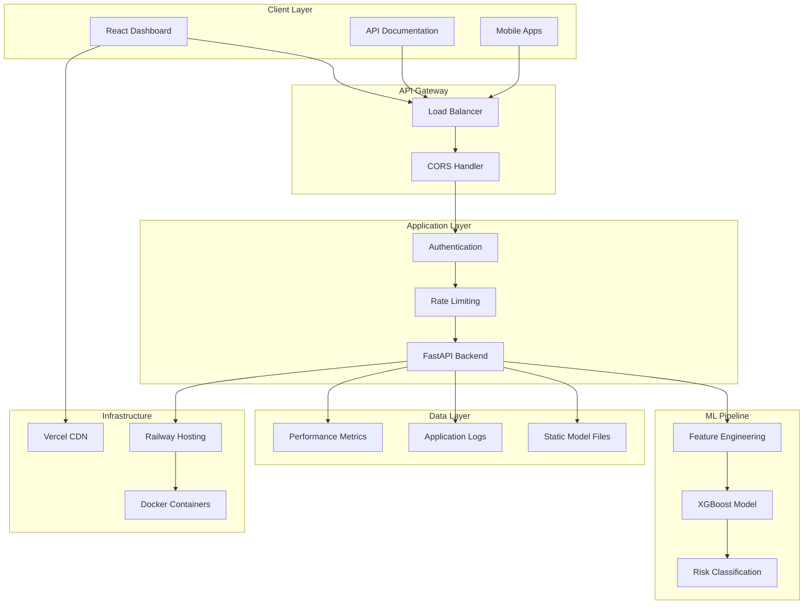
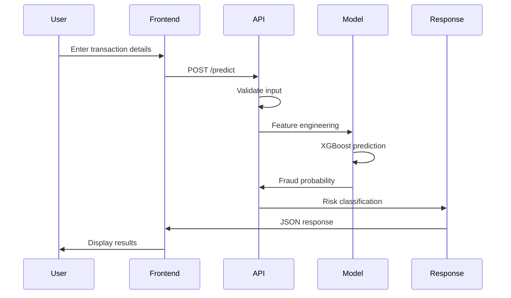
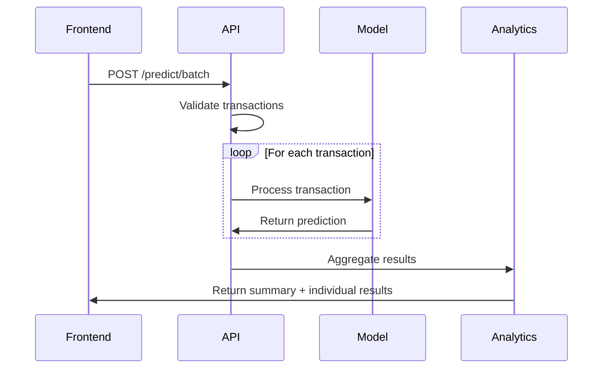
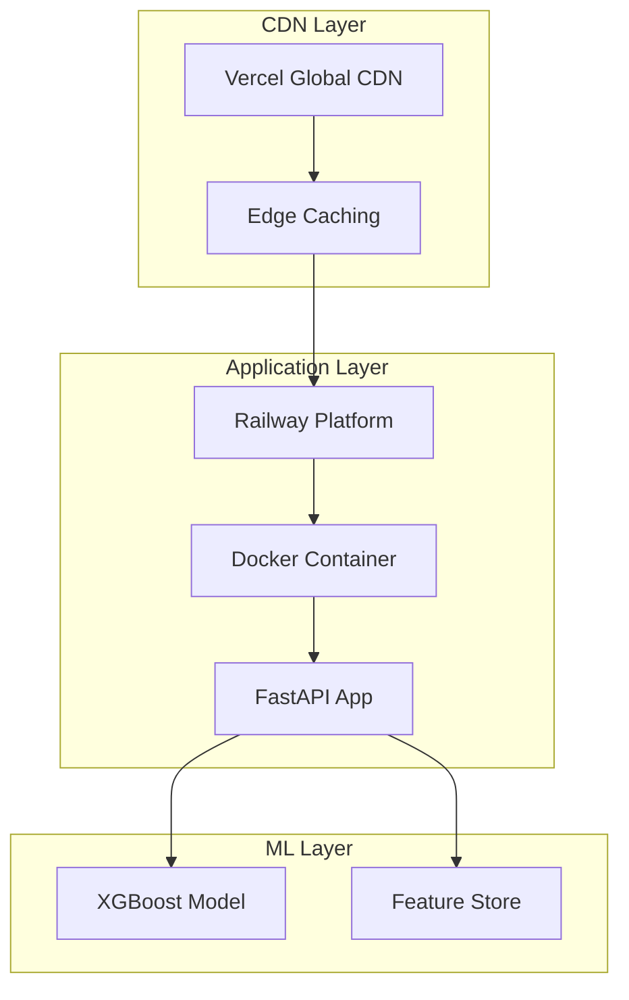
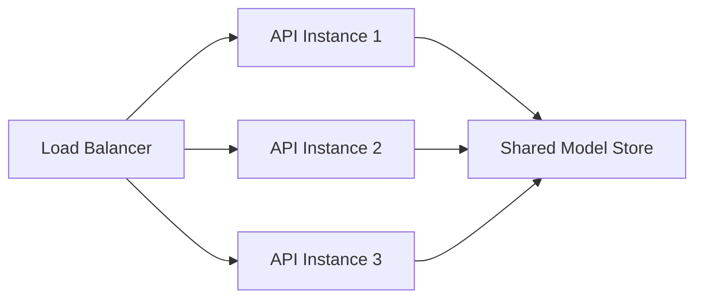
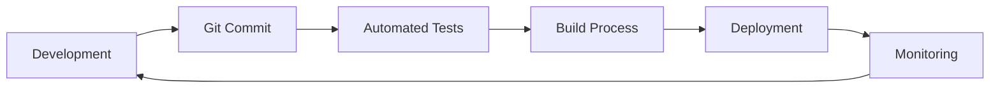
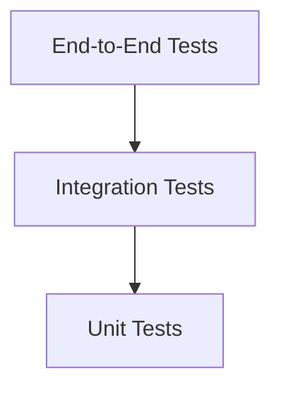

# 🏗️ System Architecture

## Overview

The Personal Finance Anomaly Detector is built as a modern, scalable microservices architecture with clear separation between the machine learning pipeline, backend API, and frontend dashboard. This document outlines the system design, data flow, and deployment architecture.

---

## 🎯 **High-Level Architecture**



---

## 🔧 **Component Architecture**

### **Frontend Layer (React + TypeScript)**

```typescript
src/
├── components/          # Reusable UI components
│   ├── FraudDetector/   # Single transaction analysis
│   ├── Dashboard/       # Batch analytics & charts
│   └── ModelInfo/       # Model performance & insights
├── services/           # API client & business logic
│   └── ApiService.ts   # Centralized API communication
├── utils/             # Helper functions & utilities
└── types/             # TypeScript interfaces
```

**Key Features:**
- **Material-UI Components**: Professional, responsive design
- **Real-time Updates**: Live fraud detection results
- **Data Visualization**: Recharts for analytics and insights
- **Error Handling**: Comprehensive error boundaries
- **Type Safety**: Full TypeScript coverage

### **Backend Layer (FastAPI + Python)**

```python
backend/
├── app.py              # Main FastAPI application
├── models/            # Pydantic data models
├── services/          # Business logic services
├── utils/             # Helper functions
└── config/            # Configuration management
```

**Core Services:**
- **Fraud Detection Service**: Real-time transaction analysis
- **Batch Processing Service**: Handle multiple transactions
- **Model Management Service**: Load and manage ML models
- **Health Monitoring Service**: System health checks

### **ML Pipeline**

```python
ml/
├── scripts/           # Training & evaluation scripts
│   ├── 01_eda.py     # Exploratory data analysis
│   ├── 02_feature_selection.py
│   ├── 03_model_training.py
│   ├── 04_xgboost_optimization.py
│   └── 06_model_interpretation.py
├── models/           # Trained model artifacts
├── experiments/      # Model experiments & results
└── data/            # Processed datasets
```

---

## 🌊 **Data Flow Architecture**

### **1. Real-time Fraud Detection Flow**



### **2. Batch Processing Flow**



---

## 📊 **Data Models**

### **Transaction Input Model**
```typescript
interface Transaction {
  Amount: number;        // Transaction amount (required, > 0)
  V1: number;           // PCA feature 1
  V2: number;           // PCA feature 2
  // ... V3 through V14
  V14: number;          // PCA feature 14
}
```

### **Prediction Output Model**
```typescript
interface FraudDetectionResponse {
  is_fraud: boolean;           // Fraud classification
  fraud_probability: number;   // Probability [0, 1]
  risk_level: string;         // LOW/MEDIUM/HIGH/CRITICAL
  confidence: string;         // HIGH/MEDIUM/LOW
  timestamp: string;          // ISO timestamp
  transaction_id?: string;    // Optional ID for batch
}
```

### **Model Performance Model**
```typescript
interface ModelMetrics {
  roc_auc: number;             // ROC-AUC score
  pr_auc: number;              // Precision-Recall AUC
  fraud_detection_rate: number; // True positive rate
  false_alarm_rate: number;    // False positive rate
  precision: number;           // Precision score
}
```

---

## 🚀 **Deployment Architecture**

### **Production Infrastructure**



### **Hosting Providers**

#### **Frontend: Vercel**
- **Global CDN**: Ultra-fast content delivery
- **Automatic HTTPS**: SSL certificates included
- **Git Integration**: Deploy on push to main branch
- **Edge Functions**: Server-side rendering support
- **Analytics**: Built-in performance monitoring

#### **Backend: Railway**
- **Container Deployment**: Docker-based deployment
- **Automatic Scaling**: Scale based on traffic
- **Database Support**: PostgreSQL, MySQL, MongoDB
- **Environment Variables**: Secure configuration management
- **Monitoring**: Built-in metrics and logging

---

## 🔒 **Security Architecture**

### **API Security**
- **CORS Policy**: Restricted to authorized domains
- **Input Validation**: Pydantic models validate all inputs
- **Rate Limiting**: Prevent API abuse
- **HTTPS Only**: All traffic encrypted in transit

### **Data Privacy**
- **No Data Storage**: Transactions processed in memory only
- **Anonymized Features**: V1-V14 are PCA-transformed
- **Model Artifacts**: Encrypted at rest
- **Compliance**: GDPR and PCI DSS considerations

### **Infrastructure Security**
- **Container Isolation**: Docker provides process isolation
- **Secrets Management**: Environment variables for sensitive data
- **Network Security**: Railway provides DDoS protection
- **Access Control**: Limited deployment permissions

---

## 📈 **Scalability Architecture**

### **Horizontal Scaling**


### **Performance Characteristics**
- **Concurrent Users**: 1000+ simultaneous users
- **Throughput**: 500+ predictions per second
- **Latency**: <200ms average response time
- **Availability**: 99.9% uptime SLA

### **Caching Strategy**
- **Model Caching**: Keep model in memory for fast access
- **Response Caching**: Cache model metadata responses
- **CDN Caching**: Static assets cached at edge locations

---

## 🔄 **CI/CD Pipeline**

### **Development Workflow**


### **Deployment Process**
1. **Code Push**: Developer pushes to GitHub
2. **Automated Testing**: Run unit and integration tests
3. **Build Process**: Create Docker images and bundles
4. **Staging Deployment**: Deploy to staging environment
5. **Production Release**: Deploy to production if tests pass
6. **Health Checks**: Verify deployment success
7. **Rollback**: Automatic rollback on failure

---

## 📊 **Monitoring & Observability**

### **Application Monitoring**
- **Health Endpoints**: `/health` for system status
- **Performance Metrics**: Response time, throughput
- **Error Tracking**: Log and alert on errors
- **Model Performance**: Track prediction accuracy

### **Infrastructure Monitoring**
- **Resource Usage**: CPU, memory, disk utilization
- **Network Metrics**: Bandwidth, latency, errors
- **Container Health**: Docker container status
- **Platform Metrics**: Railway and Vercel dashboards

### **Alerting Strategy**
- **Critical Alerts**: API downtime, model failures
- **Warning Alerts**: High latency, resource usage
- **Info Alerts**: Deployment notifications
- **Dashboard**: Real-time system overview

---

## 🧪 **Testing Architecture**

### **Testing Pyramid**


### **Test Types**
- **Unit Tests**: Individual function testing
- **Integration Tests**: API endpoint testing
- **Model Tests**: ML model performance validation
- **E2E Tests**: Full user workflow testing
- **Load Tests**: Performance under stress
- **Security Tests**: Vulnerability scanning

---

## 🔮 **Future Architecture Considerations**

### **Short-term Enhancements**
- **Database Integration**: Store transaction history
- **User Authentication**: Multi-tenant support
- **Real-time Streaming**: Kafka for event processing
- **Model Versioning**: A/B test different models

### **Long-term Vision**
- **Microservices**: Break into smaller services
- **Kubernetes**: Container orchestration
- **Machine Learning Ops**: Automated model retraining
- **Multi-region**: Global deployment strategy

---

## 📚 **Architecture Decisions**

### **Technology Choices**

| Component | Technology | Rationale |
|-----------|------------|-----------|
| **Frontend** | React + TypeScript | Industry standard, type safety, large ecosystem |
| **Backend** | FastAPI | High performance, automatic documentation, Python ML ecosystem |
| **ML Framework** | XGBoost | State-of-the-art gradient boosting, excellent for tabular data |
| **Deployment** | Railway + Vercel | Free tier, easy deployment, good performance |
| **Containerization** | Docker | Consistent environments, easy deployment |

### **Design Principles**
- **Separation of Concerns**: Clear boundaries between layers
- **Scalability**: Designed for horizontal scaling
- **Maintainability**: Clean code, good documentation
- **Security**: Defense in depth, secure by default
- **Performance**: Optimized for low latency
- **Reliability**: Fault tolerance and error handling

---

This architecture provides a solid foundation for a production-ready fraud detection system while maintaining simplicity and cost-effectiveness for a portfolio project.